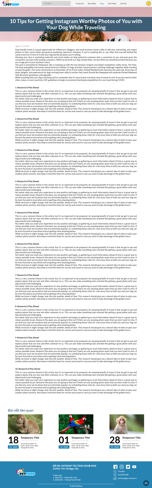
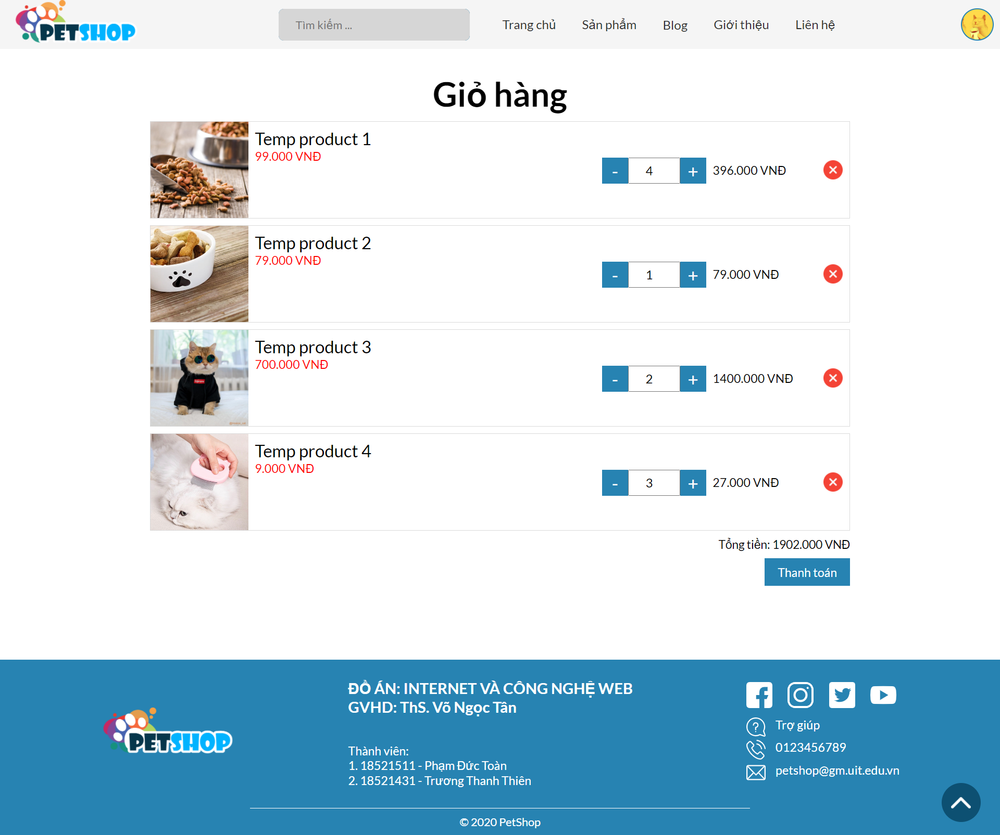

# PetShop-CNWeb

## Đồ án môn Internet và công nghệ web

### GVHD: Ths. Võ Ngọc Tân

### GVTG: Thầy Tô Quốc Huy

---

Danh sách thành viên:

| MSSV     | Họ tên             |
| -------- | ------------------ |
| 18521511 | Phạm Đức Toàn      |
| 18521431 | Trương Thanh Thiên |

---

## Các bước chạy project

1. Clone repo từ github về máy local

2. Vào thư mục vừa clone và chạy lệnh "npm install" trên termial hoặc cmd tùy vào hệ điều hành

3. Sau đó chạy lệnh "npm start"

4. Vào trình duyệt gõ địa chỉ "http://localhost:3000/" để xem hết quả

   > Note: Trường hợp bị lỗi do đụng port thì thay port 3000 thành số khác rồi tiến hành chạy lại

---

## Các hình ảnh của trang web

------

## Cảm ơn thầy đã xem đồ án của nhóm.